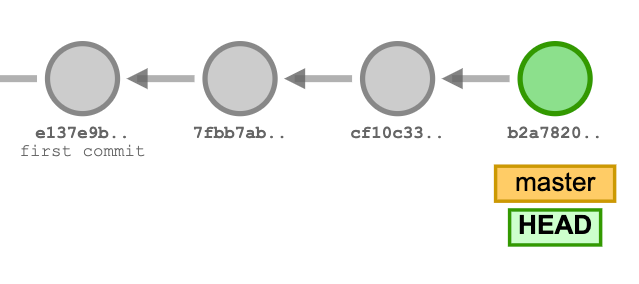
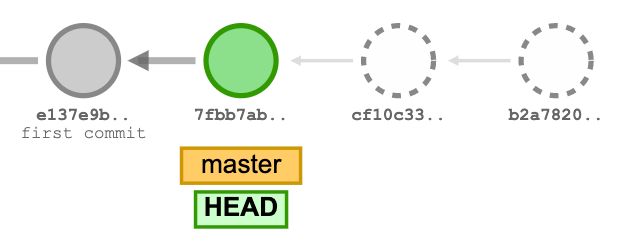
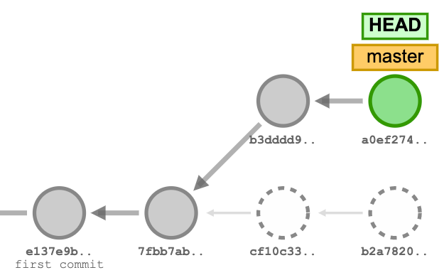
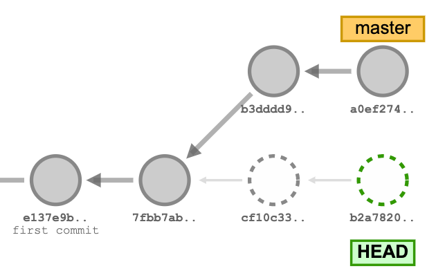

## Exercise

Go to the [Git School Visualization tool](http://git-school.github.io/visualizing-git/#free) and practice creating and rolling back commits.

1. Add a few commands, so your screen looks like this:

1. Reset a couple commits, so your screen looks like this:

1. Create 2 new commits, so you screen looks like this:

1. Use the `checkout` command to check out the latest commit that was abandoned when you reset:

